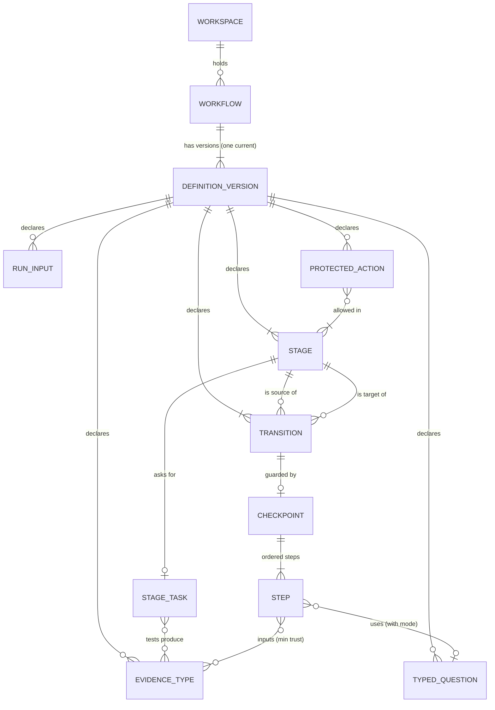
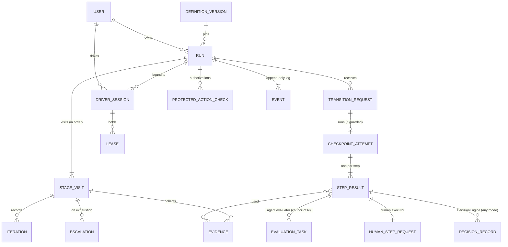
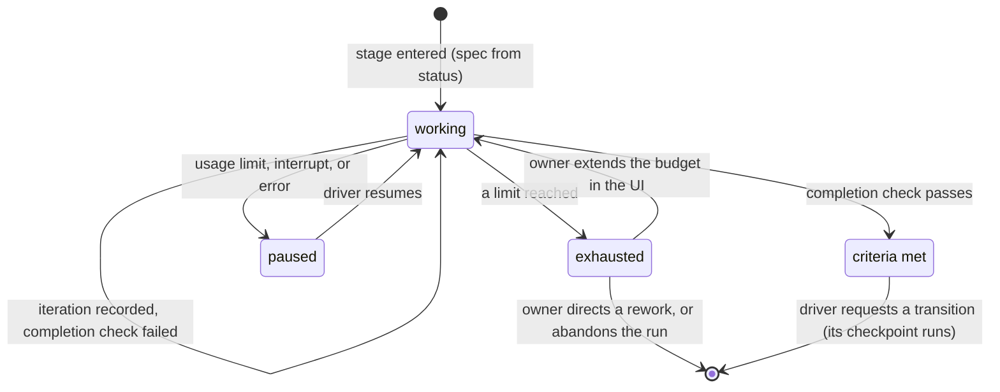
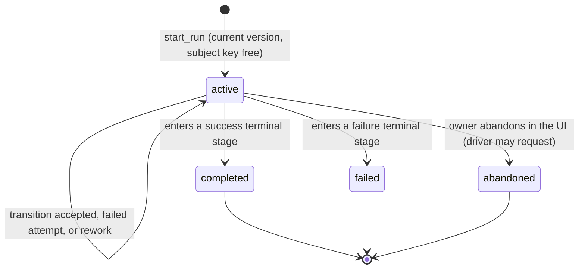
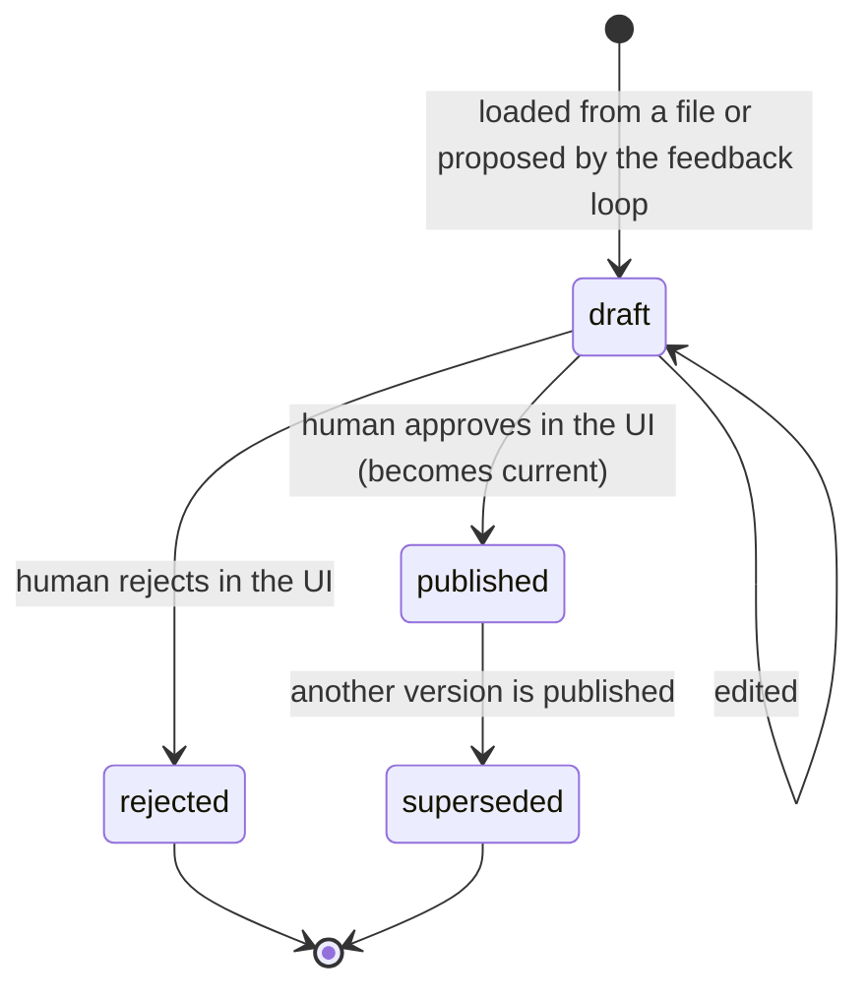
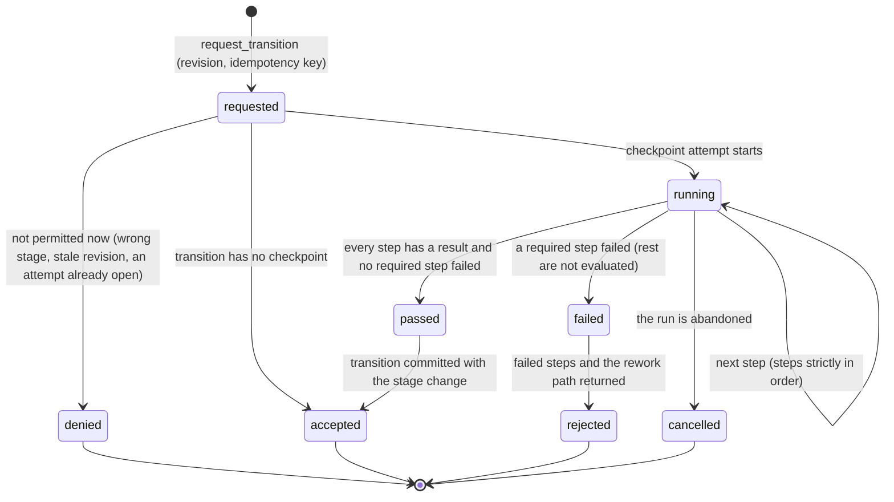
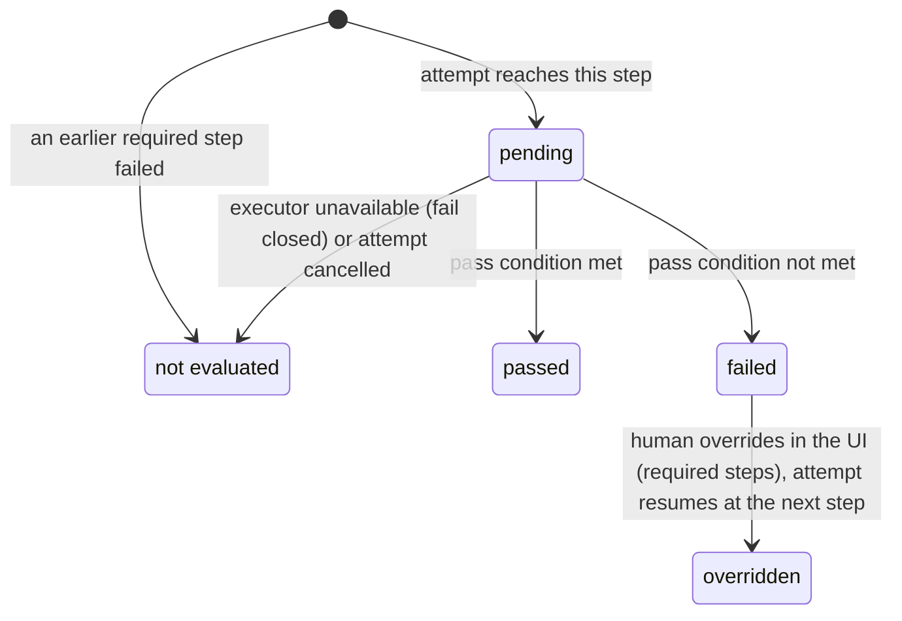
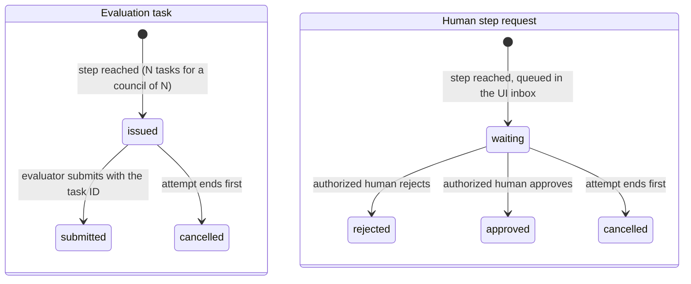
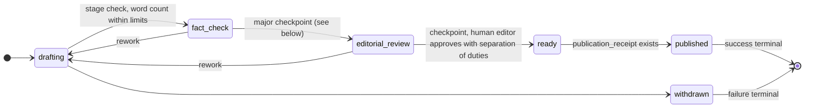

# Domain model

From spike 001 (`specs/001-concepts-what-a-workflow-is/`), where every point is decided in the Log. Terms are defined in `glossary.md`.

## Entities and relationships

Definition side: what a published definition version contains.

Run side: what the engine creates while a run executes.

Rules the diagrams cannot show:

- A run pins the definition version that was current when it started. Later versions never change it.
- At most one active run exists per workflow and subject key.
- A run has exactly one current stage, which is the stage of its latest stage visit.
- A run has at most one active lease.
- A run has at most one open checkpoint attempt. While it is open, the driver waits: it cannot withdraw the attempt or request another transition. It can still submit evidence. The open attempt ignores it unless its revision matches; it is there for the next request.
- A transition with no checkpoint commits as soon as it is requested and validated.
- A step reads evidence of its input types from the latest visit of the stage where that type was submitted. Evidence is validated at decision time against the revision in the transition request.

## Lifecycles

### Stage visit and its stage task

Iteration limits are enforced by the driver kit and recorded by the engine, so an overrun is visible. Wall time per stage visit the engine measures from its own timestamps. Only exhaustion escalates; paused work does not. Iterating is how the Claude Code kit is expected to do the work (a goal loop driven by a Stop hook), not something the model requires.

### Run

Score classification is separate from status and derived from it:

| Run status | Score classification |
| --- | --- |
| `completed` with no override | `scored` |
| `completed` with an override | `overridden` |
| `failed` or `abandoned` | `excluded`, with the partial score shown separately |

### Definition version

Revert publishes a copy of an older version as a new draft, which then follows the same path.

### Transition request and checkpoint attempt

A failed attempt leaves the run in its stage; the driver can request again. The driver cannot withdraw an open attempt; only abandoning the run cancels it. Each new attempt re-runs every step. Each failed attempt of a required step earns its deduction.

### Step result

`not evaluated` is never `passed`. An override keeps the raw result and flags the run score.

### Evaluation task and human step request

When an attempt is cancelled (the run is abandoned), its open evaluation tasks and human step requests become `cancelled`, and late submissions are rejected. Nothing waits in the UI inbox for a dead attempt. Timeouts and retries of evaluation tasks, and human steps scored on a rubric band, are in BACKLOG "Next".

## What the engine knows versus what definitions declare

| The engine knows (generic) | Only definitions declare (content) |
| --- | --- |
| Workflow, definition version, stage, transition, rework flag, checkpoint, step, run, stage visit | Stage names, the graph, which transitions are rework |
| Stage task template, iterations, limits (iterations, wall time, consecutive failed checks), exhaustion escalation | Each stage's task, acceptance criteria, tests, and limit values |
| Executor kinds, step roles, pass conditions, scales, councils, deductions | Rubric text, bands, points, thresholds |
| Evidence, trust levels, opaque revision, provenance | Evidence type names (`diff`, `test_summary`, `fact_check_report`) |
| Run inputs as opaque data, subject key | Which inputs exist (repository, branch, document ID) |
| Protected action, allowed stages, authorization | Action names (`merge`, `publish`) |
| Typed question, labels, modes, DecisionEngine | Question wording and label sets |
| Driver capabilities, sessions, leases, actor types, events | Which capabilities a workflow requires |

SDLC terms found outside definitions, and their neutral form:

- "Max turns": a provider term. Definitions use *iterations*; each driver kit maps them to its own turns or hooks.

- "One run per branch" (BACKLOG, CLAUDE.md): one active run per workflow and subject key; the SDLC kit uses repository + branch as the subject.
- Engine-verified evidence by "resolving a commit on the shared remote" (intent doc, Evidence and trust): post-MVP, through a verifier adapter outside the engine core. In the core, a revision is an opaque string.

## Toy workflow: article publication

A deliberately non-SDLC workflow, sketched on paper to check that every concept fits without SDLC terms.

- **Subject key:** the article ID. **Run inputs:** article ID, title, target section.
- **Revision:** the document's revision number in the editing tool.
- **Driver:** a writing agent working on the article.

Stage task of `drafting`, as configured by this workflow:

- **Task:** "Write the article {{title}} for section {{target_section}}."
- **Acceptance criteria:** "Every claim has a source in the source list; length within the section's limits."
- **Tests:** evidence `source_list` and `word_count` produced by the stage task.
- **Limits:** 8 iterations, 2 hours per visit, 3 consecutive failed completion checks.

The major checkpoint `fact_check → editorial_review`:

1. Required, deterministic: evidence `source_list` exists and has at least 3 entries (minimum trust: driver-reported).
2. Required, agent evaluator: "claims supported by sources", scale 1–10 with a rubric, pass at 6, council of 3.
3. Optional, agent evaluator: "readability", scale 1–5 with a rubric.
4. Shadow, Laya: typed question "publication risk" with labels `low`, `medium`, `high`, alongside step 2.

Protected action `publish` is allowed only in stage `ready`. The driver's hook calls `authorize_action` with the current revision. After publishing, the driver submits `publication_receipt` and requests `ready → published`.

**Result:** every concept maps without an SDLC term. The engine needed nothing beyond the generic vocabulary in the table above.
