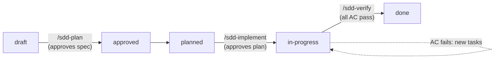
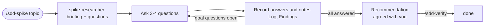

# Specs: how work gets done here

A lightweight spec-driven development (SDD) kit. Every piece of work, spike or feature, starts as a spec in this folder, moves through a few reviewed steps, and is tracked here until it is done. The kit is plain Markdown, one shell script, six Claude Code skills, and one subagent.

## Where things live

| Level | File | Answers |
| --- | --- | --- |
| Product intent | `WORKFLOW_ENGINE_INTENT.md` | What we are building and why, long term |
| Roadmap | `PLAN.md`, `BACKLOG.md` | Which phase we are in, what the MVP needs, which decisions are open |
| Rules | `specs/constitution.md` | What every design must respect |
| Work items | `specs/NNN-slug/` | What one slice of work does, how, and how far along it is |
| Progress | `specs/STATUS.md` | Generated board of every spec |

A spec usually delivers one checklist item of `PLAN.md` (a spike, a scaffolding item, a Phase 1 deliverable). If an item is too big for a few days of work, split it into several specs that depend on each other.

## Lifecycle

Features and spikes take different routes. A feature is specified, planned, and built. A spike is an interview: an agent prepares the questions, you answer and add information over as many sessions as it takes, and it ends with agreed decisions.

### Features



| Status | Meaning | Set by |
| --- | --- | --- |
| `draft` | Spec written, may still have open questions | `/sdd-specify` |
| `approved` | Spec reviewed; no open questions | `/sdd-plan` (running it is the approval) |
| `planned` | Plan and tasks written | `/sdd-plan` |
| `in-progress` | Tasks being done | `/sdd-implement` (running it is the approval of the plan) |
| `done` | Every acceptance criterion verified with evidence | `/sdd-verify` |
| `blocked` | Cannot continue; the reason is in the spec's changelog | anyone |
| `dropped` | Will not be done; the reason is in the spec's changelog | anyone |

Each step stops for human review before the next one starts. The human gates are simply running the next command.

### Spikes



Spikes go `draft → in-progress → done`, with no plan step.

1. `/sdd-spike 1` (or a topic, or a spec ID) creates the spike from its `BACKLOG.md` entry, with one **goal question** per question there.
2. The `spike-researcher` agent (`.claude/agents/`) reads the repository and current docs and writes a **briefing** (what is known, what is only suggested, and what is unknown, with sources). It looks up the facts it can and drafts **questions for you**, only about what you know or decide, each with why it matters, options, and a suggested answer.
3. Claude asks the questions a few at a time. Every answer goes into the **Log** and the **Findings** of the goal questions it affects, labelled as a decision, a fact, or an assumption. Answers that raise new questions get researched or added to the queue.
4. You can add information at any time: in chat during a session, as `/sdd-spike <ID> <notes>`, or by writing in the spike's **Inbox** section between sessions. The next session processes the Inbox and clears it.
5. When every goal question is answered, Claude drafts the recommendation and decisions for your agreement. `/sdd-verify <ID>` then closes the spike and updates `BACKLOG.md` and `PLAN.md`.

## Working in parallel

Several Claude Code sessions can work at once, in one checkout or in separate worktrees. Each session claims its work before starting it, so two sessions never pick the same thing:

- `/sdd-implement` claims one task at a time with `sdd claim <ID> next`. That hands out the first task that is not ticked, not claimed, and whose earlier tasks are finished. Consecutive `[P]` tasks can be handed out together, so they are where parallel work within one spec comes from.
- `/sdd-specify`, `/sdd-plan`, `/sdd-spike`, and `/sdd-verify` claim the whole spec. A spike stays claimed while its interview runs; a second session only adds notes to its Inbox.
- `sdd next` skips work other sessions hold and shows which tasks are free. `sdd status` lists the claims.

A claim is a directory created with `mkdir`, which is atomic, under `.git/sdd-claims/`. Every worktree on this machine shares it, and git does not track it. The owner is the Claude Code session ID. A finished task stays marked done until `sdd claims --prune` sees its tick, because other worktrees do not see the tick until it is merged. `sdd new` also reserves the spec ID there, so two worktrees never create the same number.

A session that ends without releasing leaves its claim behind. Claims older than 8 hours (`SDD_STALE_HOURS`) are shown as stale; free one with `sdd release <ID> [Tn] --force` once you know that session is gone. Claims only coordinate sessions on one machine.

## Artifacts

| File | Feature | Spike | Content |
| --- | --- | --- | --- |
| `spec.md` | yes | yes (spike template) | What and why: scenarios, EARS requirements, acceptance criteria. For a spike: inbox, goal questions, briefing, questions for you, log, findings, decisions |
| `plan.md` | yes | no | How: design, decisions, constitution check, test strategy, deviations |
| `tasks.md` | yes | no | Ordered, small, checkable tasks, plus verification evidence |

Templates are in `specs/_kit/templates/`. Frontmatter in `spec.md` is what the tooling reads:

```yaml
id: 003                # matches the folder number
type: feature          # feature | spike
status: draft          # see Lifecycle
phase: 1               # PLAN.md phase
depends_on: [001, 002] # specs that must be done first
refs: ["PLAN Phase 0 / Scaffolding / Engine skeleton", "BACKLOG Engine framework"]
updated: 2026-10-07
```

## Commands

In Claude Code:

| Command | Does |
| --- | --- |
| `/sdd-spike <ID, PLAN spike number, or topic> [notes]` | Runs a spike as an interview; with notes, records them first |
| `/sdd-specify <idea, PLAN item, or spec ID>` | Creates a feature spec (or refines an existing one) and asks the questions that block it |
| `/sdd-plan <ID>` | Approves the spec, then writes `plan.md` and `tasks.md` |
| `/sdd-implement <ID> [task]` | Works through the tasks in order, ticking each when its check passes |
| `/sdd-verify <ID>` | Checks every acceptance criterion (or a spike's answers), records evidence, closes the spec, updates PLAN and BACKLOG |
| `/sdd-status [ID]` | Shows the board and what to do next |

From a shell:

```sh
specs/_kit/sdd new feature "Engine skeleton"   # or: new spike "..."
specs/_kit/sdd status                          # board + next up
specs/_kit/sdd status --write                  # also regenerates specs/STATUS.md
specs/_kit/sdd next                            # only what can be worked on now
specs/_kit/sdd claim 003 next                  # claim the next free task of 003; prints its ID
specs/_kit/sdd release 003 T4 --done           # release a task claim, keeping it marked done
specs/_kit/sdd claims --prune                  # list claims, dropping the ones no longer needed
```

Progress is computed from the files: checkboxes in `tasks.md` (for a spike, the goal questions, questions for you, and deliverables in `spec.md`), and the open questions count from the `[NEEDS CLARIFICATION: …]` markers in `spec.md` and `plan.md`. HTML comments are ignored, so template guidance never counts.

## Good practices this kit enforces

- **What before how.** `spec.md` has no technology in it; `plan.md` has no new requirements in it.
- **No guessing.** Unknowns are written as `[NEEDS CLARIFICATION: …]` and must be resolved before planning.
- **Testable requirements.** Requirements use EARS ("When …, the engine shall …"). Every requirement is covered by an acceptance criterion, and every acceptance criterion by a test or a recorded manual check.
- **Traceability.** IDs link everything: R1 → AC-1 → T3 → commit `[003] T3 …` → evidence row.
- **Small tasks.** Half a day at most, each leaving the build green, test first where it fits.
- **Living documents.** When reality disagrees with the spec or plan, the document changes first and the change is logged (spec changelog, plan Deviations).
- **Decisions on record.** Every real choice gets a row with alternatives and rationale; settled BACKLOG items are updated in place.
- **Constitution check.** Every plan states how it respects the articles it touches.
